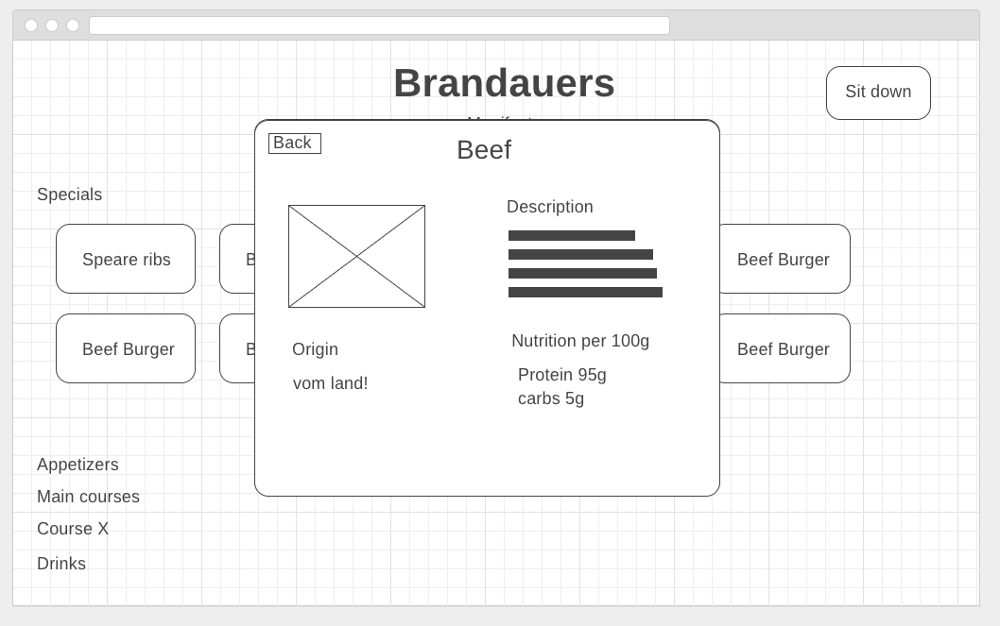

# RestCard #

## Introduction
RestCard is a simple and easy to use menu. It hopes to help save paper, and help out waiters who already have so much on their plate (pun intended).

Basically, the goal is to have an app that easily lets the user scroll through the menus of restaurants nearby. The menus will be easily readable and the user should be able to quickly navigate through the sections so he can find the dishes the he is interested in.

Once the user has found his preferred dish he can see exactly what he is eating with an overview of the ingredients. Further, the user can look at each ingredient individually for more detail.

## Wireframes

Using wireframe.cc I created four views. These views show the minimum viable product.

### Home screen
path: `/`

In this view we can see a title, a search bar and a list of restaurants. By searching the user can open the restaurant view directly of a restaurant that is not close by. He must of course know the name of the restaurant. Suggestions while the user is typing will help him find the right one. The list of restaurants below the search bar is there to give the user easy access to what is around him. For this to be possible we will need access to the users location as well as access to the location of the restaurants.
### Restaurant
path: `/<name of restaurant>/`

This view is displayed once the user has selected a restaurant in one of the two ways described above. Here we can see the different sections of a restaurant menu. All sections are collapsed apart from the specials. If a section is collapsed only the title of the section will show and the dishes are hidden. The special section is not collapsed and displays different dishes that the restaurant has to offer. The user can click on any one of those dishes.
### A Dish (Modal View)
path: `/<name of restaurant>/<dish>`

This view is displayed once the user clicks on one of the dishes from the Restaurant view. Here the restaurant can advertise a single dish with a nice description. To the left of the description is an image from the dish.
### Ingredient
path: `/<name of restaurant>/<dish>`

This view is displayed when the user clicks on one of the ingredients in the previous view. Here the user can see, in more detail, what the ingredient is and what nutrition values it entails. This view will be a default view that we provide for an ingredient but it can also be customized by the restaurant. The back button at the top left of the screen will bring the user back to the dish view.
